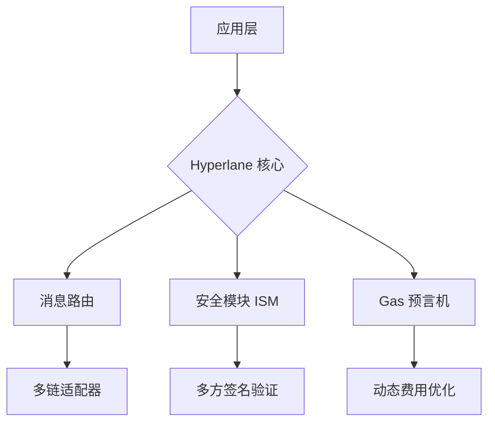

<p align="center">
  
</p>

<h1 align="center">🌐 Hyperlane 中文开发者社区</h1>

<p align="center">
  <strong>无需许可的模块化跨链协议 | 构建 Web3 的通用互操作层</strong>
</p>

<p align="center">
  <a href="https://github.com/HyperlaneDevCN/hyperlane-core/actions"></a>
  <a href="https://discord.gg/hyperlane"></a>
  <a href="https://github.com/HyperlaneDevCN/hyperlane-core/blob/main/LICENSE"></a>
</p>

---

## 🚀 核心特性

### 🌈 全链互操作性
- **任意链连接**：支持 EVM、Cosmos、Move 等多链生态的资产与消息跨链
- **主权安全模型**：基于 [Interchain Security Modules (ISM)](https://docs.hyperlane.xyz/docs/sovereign-consensus/ism) 的模块化安全层

### 🛠️ 开发者优先
- **即插即用 SDK**：5 行代码集成跨链功能
- **本地测试网**：支持 Foundry/Hardhat 的跨链开发环境


### 🔒 企业级安全
- **漏洞赏金**：最高 $2,500,000 奖励 ([Immunefi](https://immunefi.com/bounty/hyperlane/))

---

## 🧩 技术架构



---

## 🛠️ 快速开始

### 1. 安装 CLI
```bash
npm install -g @hyperlane-dev/cli
```

### 2. 部署跨链合约
```solidity
// 使用 Hyperlane 的 Mailbox 合约发送跨链消息
IMailbox mailbox = IMailbox(0x123...);
bytes32 messageId = mailbox.dispatch(
  destinationChainId,
  recipientAddress,
  "Hello Multichain World!"
);
```

### 3. 监控跨链状态
```bash
hyperlane track --message-id 0xabcd...
```

---

## 🌍 社区共建

### 👥 参与方式
- **加入社群**
- **使用hyperlane**
- **参与中文文档的构建**


---

## 📚 资源导航
- [📖 官方文档](https://docs.hyperlane.xyz/zh)
- [💬 中文社区](https://hyperlane.cc)
- [🐦 中文 TG](https://t.me/hyperlanecc)
```

